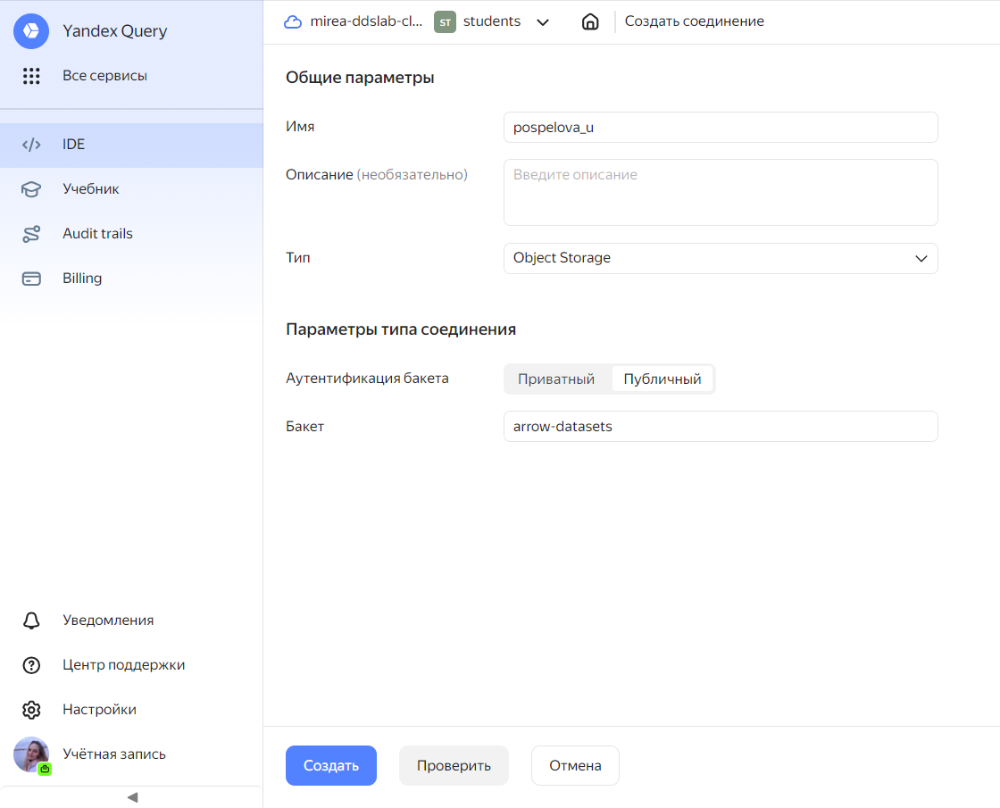
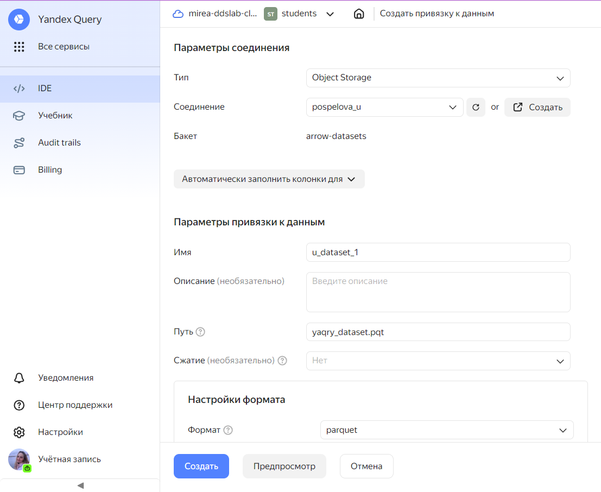
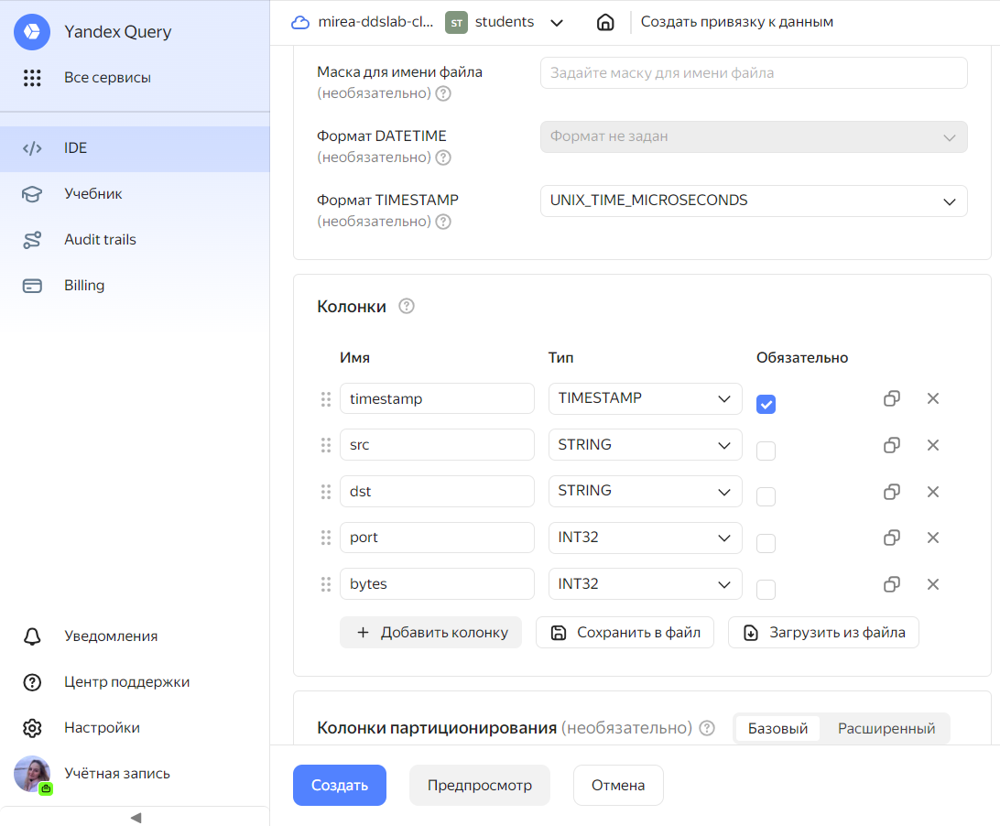
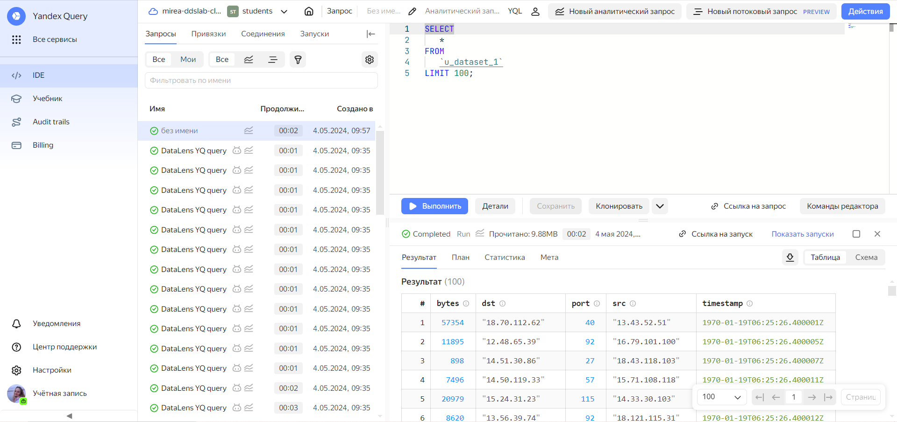
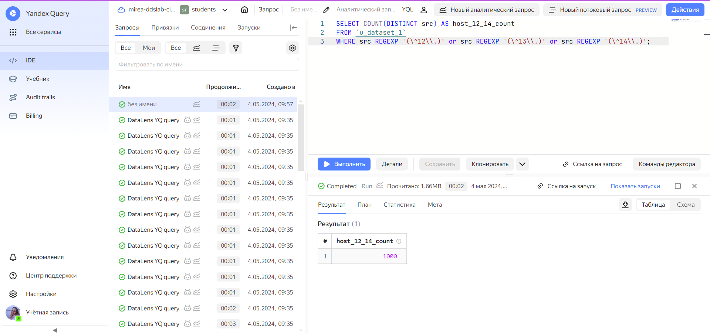
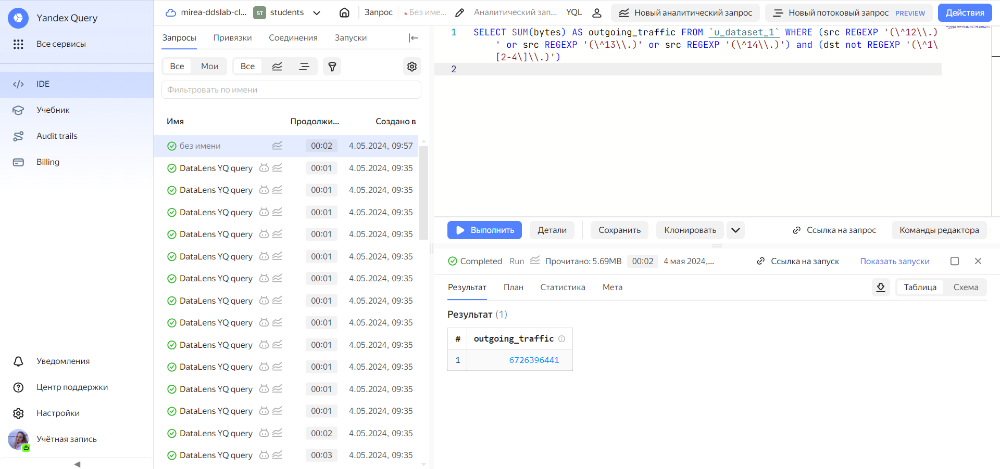
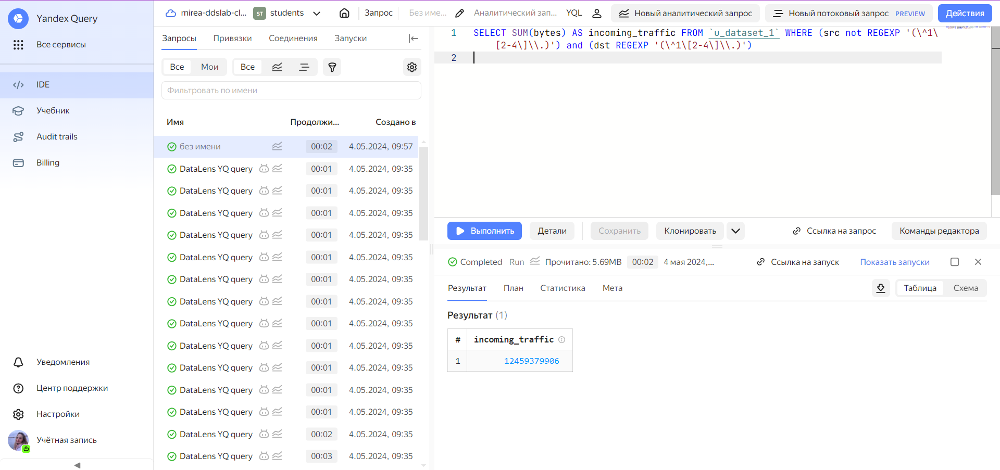

# Лабораторная работа №1. Использование технологии Yandex Query для
анализа данных сетевой активности
Поспелова Ульяна БИСО-03-20

## Цель работы

1.  Изучить возможности технологии Yandex Query для анализа
    структурированных наборов данных.

2.  Получить навыки построения аналитического пайплайна для анализа
    данных с помощью сервисов Yandex Cloud.

3.  Закрепить практические навыки использования SQL для анализа данных
    сетевой активности в сегментированной корпоративной сети.

## Общая ситуация

Вам стали доступны данные сетевой активности в корпоративной сети
компании XYZ. Данные хранятся в Yandex Object Storage. Проведите
разведочный анализ данных и ответьте на вопросы.

## Задание

Используя сервис Yandex Query настроить доступ к данным, хранящимся в
сервисе хранения данных Yandex Object Storage. При помощи
соответствующих SQL запросов ответить на вопросы.

## Ход работы

### 1. Проверка доступности данных в Yandex Object Storage

1\. Проверим доступность данных (файл yaqry_dataset.pqt) в бакете
arrow-datasets S3 хранилища Yandex Object Storage. Проверить можно
просто перейдя по правильно сконструированному URL в браузере.

    <https://storage.yandexcloud.net/arrow-datasets/yaqry_dataset.pqt>

### 2. Подключить бакет как источник данных для Yandex Query

1\. Создадим соединение для бакета в S3 хранилище.

2\. Заполним поля с учетом допустимых символов, выберем тип
аутентификации - публичный. Вводим имя бакета в соответствующее поле и
сохраняем.



3\. Теперь, после создания соединения, укажем объект, который будет
использоваться в качестве источника данных. Для этого нужно сделать
привязку данных.



4\. Опишем состав и формат входных данных.



5\. Попробуем сделать аналитический запрос и посмотреть результат.



Запрос показал не пустую таблицу, значит датасет был подключен
правильно.

### Анализ

1\. Известно, что IP адреса внутренней сети начинаются с октетов,
принадлежащих интервалу \[12-14\]. Определим количество хостов
внутренней сети, представленных в датасете.

Запрос:

SELECT COUNT(DISTINCT src) AS host_12_14_count FROM `u_dataset_1` WHERE
src REGEXP ‘(^12\\)’ or src REGEXP ‘(^13\\)’ or src REGEXP ‘(^14\\)’



Ответ: 1000 хостов

2\. Определим суммарный объем исходящего трафика

Запрос:

SELECT SUM(bytes) AS outgoing_traffic FROM `u_dataset_1` WHERE (src
REGEXP ‘(^12\\)’ or src REGEXP ‘(^13\\)’ or src REGEXP ‘(^14\\)’) and
(dst not REGEXP ‘(^1\[2-4\]\\)’)

``` r
ingb <- 6726396441
sprintf("%f байт исходящего трафика", ingb)
```

    [1] "6726396441.000000 байт исходящего трафика"

Ответ: 6726396441 байт



3\. Определите суммарный объем входящего трафика

Запрос: SELECT SUM(bytes) AS incoming_traffic FROM `u_dataset_1` WHERE
(src not REGEXP ‘(^1\[2-4\]\\)’) and (dst REGEXP ‘(^1\[2-4\]\\)’)

``` r
ingb <- 12459379906
sprintf("%f байт входящего трафика", ingb)
```

    [1] "12459379906.000000 байт входящего трафика"

Ответ: 12459379906 байт



## Вывод

В ходе работы мы закрепили практические навыки использования SQL для
анализа данных сетевой активности в сегментированной корпоративной сети
и получили навыки построения аналитического пайплайна для анализа
данных.
