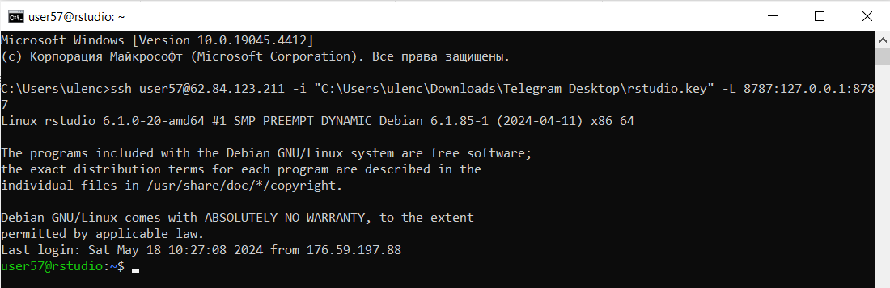
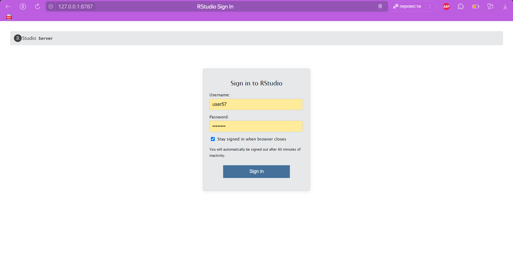

# Лабораторная работа №3. Анализ данных сетевого трафика (Arrow)
Поспелова Ульяна БИСО-03-20

## Цель работы

1.  Изучить возможности технологии Apache Arrow для обработки и анализ
    больших данных.

2.  Получить навыки применения Arrow совместно с языком программирования
    R.

3.  Получить навыки анализа метаинфомации о сетевом трафике.

4.  Получить навыки применения облачных технологий хранения, подготовки
    и анализа данных: Yandex Object Storage, Rstudio Server.

## Общая ситуация

Вы - специалист по информационной безопасности компании “СуперМегатек”.
Вы, являясь специалистом Threat Hunting, часто используете информацию о
сетевом трафике для обнаружения подозрительной и вредоносной активности.
Помогите защитить Вашу компанию от международной хакерской группировки
AnonMasons.

У Вас есть данные сетевой активности в корпоративной сети компании
“СуперМегатек”. Данные хранятся в Yandex Object Storage.

## Задание

Используя язык программирования R, библиотеку arrow и облачную IDE
Rstudio Server, развернутую в Yandex Cloud, выполнить задания и
составить отчет

## Ход работы

### Подключение

Используя ниже приведённую команду, подключимся по SSH к облачной IDE
Rstudio Server (57 - номер моего пользователя).

    ssh user57@62.84.123.211 -i "C:\Users\ulenc\Downloads\Telegram Desktop\rstudio.key" -L 8787:127.0.0.1:8787



После установления соединения сменила пароль с помощью команды passwd и
через браузер подключилась к нему через пользователя и его пароль.



### Импорт данных

``` r
library(arrow)
```

    Some features are not enabled in this build of Arrow. Run `arrow_info()` for more information.


    Attaching package: 'arrow'

    The following object is masked from 'package:utils':

        timestamp

``` r
library(dplyr)
```


    Attaching package: 'dplyr'

    The following objects are masked from 'package:stats':

        filter, lag

    The following objects are masked from 'package:base':

        intersect, setdiff, setequal, union

``` r
library(tidyverse)
```

    ── Attaching core tidyverse packages ──────────────────────── tidyverse 2.0.0 ──
    ✔ forcats   1.0.0     ✔ readr     2.1.5
    ✔ ggplot2   3.4.4     ✔ stringr   1.5.1
    ✔ lubridate 1.9.3     ✔ tibble    3.2.1
    ✔ purrr     1.0.2     ✔ tidyr     1.3.1
    ── Conflicts ────────────────────────────────────────── tidyverse_conflicts() ──
    ✖ lubridate::duration() masks arrow::duration()
    ✖ dplyr::filter()       masks stats::filter()
    ✖ dplyr::lag()          masks stats::lag()
    ℹ Use the conflicted package (<http://conflicted.r-lib.org/>) to force all conflicts to become errors

``` r
dir.create("data", showWarnings = FALSE)
```

``` r
curl::multi_download("https://storage.yandexcloud.net/arrow-datasets/tm_data.pqt", "data/tm_data.pqt",resume = TRUE)
```

    # A tibble: 1 × 10
      success status_code resumefrom url    destfile error type  modified
      <lgl>         <int>      <dbl> <chr>  <chr>    <chr> <chr> <dttm>  
    1 TRUE            416          0 https… /home/u… <NA>  appl… NA      
    # ℹ 2 more variables: time <dbl>, headers <list>

``` r
data <- read_parquet("data/tm_data.pqt", as_data_frame = FALSE)
```

``` r
glimpse(data)
```

    Table
    105,747,730 rows x 5 columns
    $ timestamp <double> 1.578326e+12, 1.578326e+12, 1.578326e+12, 1.578326e+12, 1.5…
    $ src       <string> "13.43.52.51", "16.79.101.100", "18.43.118.103", "15.71.108…
    $ dst       <string> "18.70.112.62", "12.48.65.39", "14.51.30.86", "14.50.119.33…
    $ port       <int32> 40, 92, 27, 57, 115, 92, 65, 123, 79, 72, 123, 123, 22, 118…
    $ bytes      <int32> 57354, 11895, 898, 7496, 20979, 8620, 46033, 1500, 979, 103…
    Call `print()` for full schema details

### Задание 1: Найдите утечку данных из Вашей сети

Важнейшие документы с результатами нашей исследовательской деятельности
в области создания вакцин скачиваются в виде больших заархивированных
дампов. Один из хостов в нашей сети используется для пересылки этой
информации – он пересылает гораздо больше информации на внешние ресурсы
в Интернете, чем остальные компьютеры нашей сети.

Определите его IP-адрес.

``` r
out <- data %>% select(src, dst, bytes) %>% filter(!str_detect(dst, '1[2-4].*')) %>% select(src, bytes) %>% group_by(src) %>% summarize(sum_bytes = sum(bytes)) %>% filter(sum_bytes == max(sum_bytes))
```

    Warning: Expression sum_bytes == max(sum_bytes) not supported in Arrow; pulling
    data into R

``` r
out |> collect()
```

    # A tibble: 1 × 2
      src           sum_bytes
      <chr>           <int64>
    1 13.37.84.125 5765792351

IP-адрес этого компьютера: 13.37.84.125

### Задание 2: Найдите утечку данных 2

Другой атакующий установил автоматическую задачу в системном
планировщике cron для экспорта содержимого внутренней wiki системы. Эта
система генерирует большое количество трафика в нерабочие часы, больше
чем остальные хосты.

Определите IP этой системы. Известно, что ее IP адрес отличается от
нарушителя из предыдущей задачи.

``` r
data_filter <- data %>% select(timestamp, src, dst, bytes) %>% mutate(trafic = (str_detect(src, '1[2-4].*') & !str_detect(dst, '1[2-4].*')),time = hour(as_datetime(timestamp/1000))) %>% filter(trafic == TRUE, time >= 0 & time <= 24) %>% group_by(time) %>% summarise(trafictime = n()) %>% arrange(desc(trafictime))
```

``` r
data_filter |> collect()
```

    # A tibble: 24 × 2
        time trafictime
       <int>      <int>
     1    18    3305646
     2    23    3305086
     3    16    3304767
     4    22    3304743
     5    19    3303518
     6    21    3303328
     7    17    3301627
     8    20    3300709
     9    13     124857
    10     0     124851
    # ℹ 14 more rows

``` r
data_last <- data %>% mutate(time = hour(as_datetime(timestamp/1000))) %>% filter(!str_detect(src, "^13.37.84.125")) %>% filter(str_detect(src, '1[2-4].*'))  %>% filter(!str_detect(dst, '1[2-4].*'))  %>% filter(time >= 1 & time <= 15) %>% group_by(src) %>% summarise("sum" = sum(bytes)) %>% select(src,sum)
```

Учитывая нагрузку на трафик, рабочее время с 16:00 до 00:00.

``` r
data_last <- data_last %>% arrange(desc(sum)) %>% head(1)
```

``` r
data_last |> collect()
```

    # A tibble: 1 × 2
      src               sum
      <chr>           <int>
    1 12.55.77.96 191826796

IP-адрес этого компьютера: 12.55.77.96

### Задание 3: Найдите утечку данных 3

Еще один нарушитель собирает содержимое электронной почты и отправляет в
Интернет используя порт, который обычно используется для другого типа
трафика. Атакующий пересылает большое количество информации используя
этот порт, которое нехарактерно для других хостов, использующих этот
номер порта.

Определите IP этой системы. Известно, что ее IP адрес отличается от
нарушителей из предыдущих задач.

``` r
ip1 <- data %>% filter(!str_detect(src, "^13.37.84.125")) %>% filter(!str_detect(src, "^12.55.77.96")) %>% filter(str_detect(src, "^12.") | str_detect(src, "^13.") | str_detect(src, "^14."))  %>% filter(!str_detect(dst, "^12.") | !str_detect(dst, "^13.") | !str_detect(dst, "^14."))  %>% select(src, bytes, port)
```

``` r
ip2 <-ip1 %>%  group_by(port) %>% summarise("mean"=mean(bytes), "max"=max(bytes), "sum" = sum(bytes)) %>%  mutate("raz"= max-mean)  %>% filter(raz!=0, raz>170000)
```

``` r
ip2 |> collect()
```

    # A tibble: 1 × 5
       port   mean    max         sum     raz
      <int>  <dbl>  <int>     <int64>   <dbl>
    1    37 33348. 209402 48192673159 176054.

``` r
ip3 <- ip1  %>% filter(port==37) %>% group_by(src) %>% summarise("mean"=mean(bytes)) %>% filter(mean>37543) %>% select(src)
```

``` r
ip3 |> collect()
```

    # A tibble: 1 × 1
      src        
      <chr>      
    1 13.46.35.35

IP-адрес этой системы: 13.46.35.35

## Вывод

В ходе работы мы изучили возможности технологии Apache Arrow для
обработки и анализ больших данных.
